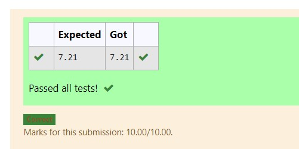

# DISTANCE-BETWEEN-TWO-POINTS

## AIM:
To write a python program to find the distance two 2 points
## ALGORITHM:
### Step 1:start the program  
### Step 2:using the user given input 
### Step 3:import math 
Substitute the values in the distance formula  
### Step 4:assign a value to the math.sqrt 
### Step 5:print the program 
### PROGRAM:
#Program to find the distance between two points.
#Developed by:shyamnaveenraj 
#RegisterNumber:21005660
x1,x2=10,4
y1,y2=6,2
import math
value=math.sqrt((x2-x1)**2+(y2-y1)**2)
print("{:.2f}".format(value))
  

### OUTPUT:

### RESULT:
thus got the output successfully
